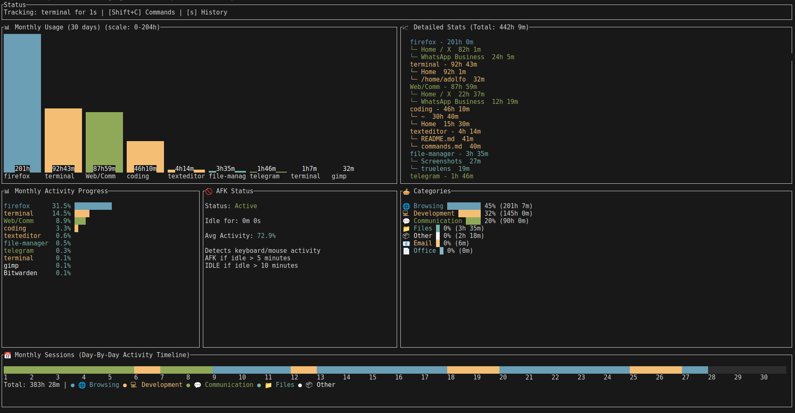

[](https://www.rust-lang.org)
[](https://ratatui.rs)
[](https://docker.com)
[](https://github.com/casey/just)
[](https://www.postgresql.org)

[](https://meetneura.ai) [](https://meetneura.ai)

# Neura Hustle Tracker BETA

**Track what apps you use and how long you spend on them.**

This app runs in your terminal and shows you exactly where your time goes during work sessions. Built with Ratatui.




## Download Pre-Built Binaries (Easiest!)

**No Rust installation needed!** Download ready-to-use binaries for your platform from [GitHub Releases](https://github.com/adolfousier/neura-hustle-tracker/releases):

- **Linux**: [neura_hustle_tracker-linux-x86_64](https://github.com/adolfousier/neura-hustle-tracker/releases)
- **macOS (Intel)**: [neura_hustle_tracker-macos-x86_64](https://github.com/adolfousier/neura-hustle-tracker/releases)
- **macOS (Apple Silicon)**: [neura_hustle_tracker-macos-aarch64](https://github.com/adolfousier/neura-hustle-tracker/releases)
- **Windows**: [neura_hustle_tracker-windows-x86_64.exe](https://github.com/adolfousier/neura-hustle-tracker/releases)

**Prerequisites**: [Docker](https://docs.docker.com/get-docker/) must be installed and running.

Download, make executable on Linux/macOS (`chmod +x neura_hustle_tracker-*`), and run. The binary will automatically:
1. Generate database credentials (`.env` file)
2. Start PostgreSQL via Docker Compose
3. Run database migrations
4. Launch the app

**Note**: On macOS/Windows, you'll also need the daemon binary (`neura_hustle_daemon`) running in the background.

## What Does This Do?

- **Tracks your app usage** - Automatically monitors which programs you're using
- **Shows pretty charts** - See your time broken down by app and category
- **Saves your data** - Everything stored locally in your own PostgreSQL database
- **Works everywhere** - Linux, macOS, and Windows

## Quick Start (Easiest Way)

### Linux

Copy and paste this into your terminal:

```bash
sudo apt update && sudo apt install -y docker.io curl git openssl && curl --proto '=https' --tlsv1.2 -sSf https://sh.rustup.rs | sh -s -- -y && source ~/.cargo/env && cargo install just && git clone https://github.com/adolfousier/neura-hustle-tracker.git && cd neura-hustle-tracker && just run
```

That's it! The app will start tracking automatically.

### macOS

1. Install [Docker Desktop](https://docs.docker.com/desktop/install/mac-install/) first
2. Then paste this into Terminal:

```bash
brew install git rustup-init && rustup-init -y && source ~/.cargo/env && cargo install just && git clone https://github.com/adolfousier/neura-hustle-tracker.git && cd neura-hustle-tracker && just daemon-start
```

3. View your stats anytime: `just view`

### Windows

1. Install [Docker Desktop](https://www.docker.com/products/docker-desktop/)
2. Open PowerShell as Administrator
3. Run this:

```powershell
powershell -Command "iwr -useb https://raw.githubusercontent.com/adolfousier/neura-hustle-tracker/main/src/scripts/windows_build/windows-install.ps1 | iex"
```

4. View your stats anytime: `just view`

## Already Have Rust and Docker?

If you already have the prerequisites installed:

```bash
git clone https://github.com/adolfousier/neura-hustle-tracker
cd neura-hustle-tracker
cargo install just
just run
```

Done! The app handles everything else automatically.

## How to Use It

Once the app is running:

- **d** - Switch to Daily view
- **w** - Switch to Weekly view
- **m** - Switch to Monthly view
- **s** - View session history
- **b** - View activity breakdowns
- **r** - Rename apps to organize them better
- **c** - Change app category
- **l** - View logs
- **Shift+C** - See all available commands
- **q** - Quit

**Timeline Feature (v0.4.16+)**:
- Daily view shows a 24-hour colored activity timeline at the bottom
- Each hour is colored by your dominant activity category
- Weekly and monthly views show daily activity patterns with matching data
- See your category colors at a glance (Development=Yellow, Browsing=Blue, Communication=Green, Media=Magenta, Files=Cyan)

The app tracks automatically. Just switch between your programs normally and it records everything.

## Two Ways to Run (Important!)

### Linux Users → Use "Unified Mode"

Run `just run` and you're done. Everything works in one window.

**Available commands for Linux:**

- `just run` - Start DB + build + run app (all in one!)
- `just dev` - Start DB + run in dev mode (faster builds)
- `just db-up` - Start PostgreSQL in Docker
- `just db-down` - Stop PostgreSQL
- `just build` - Build TUI binary only
- `just build-daemon` - Build daemon binary only
- `just clean` - Clean all build artifacts and stop DB
- `just help` - Show all available commands

### macOS/Windows Users → Use "Daemon Mode"

You need two steps because of how these systems work:

1. **Start tracking in background**: `just daemon-start`
2. **Open the dashboard**: `just view`

Why? On macOS/Windows, if the tracking runs in the dashboard window, it can't see when you switch to other apps. Running it in the background fixes this.

**Commands for daemon mode:**

- `just daemon-start` - Start tracking
- `just view` - Open dashboard
- `just daemon-stop` - Stop tracking
- `just daemon-status` - Check if running

## What You Need

- **Computer**: Windows 10+, macOS 10.15+, or Linux with a desktop
- **Space**: About 500MB for Docker and dependencies
- **Permissions**:
  - **macOS**: Terminal application needs the following permissions (daemon binary itself does NOT need permissions):
    - Accessibility
    - Screen & System Audio Settings
    - Input Monitoring
  - **Windows**: Works out of the box
  - **Linux**: Needs a desktop environment (GNOME, KDE, Hyprland, etc.)

  **Note**: On macOS/Windows, the daemon runs in the background without needing permissions. The **Terminal application** itself needs the permissions listed above to monitor your system properly.

## Special Notes

**Wayland users (Linux)**:
- **Hyprland**: Window tracking works out of the box via `hyprctl` (no extra setup needed).
- **GNOME**: Install the [Window Calls extension](https://extensions.gnome.org/extension/4724/window-calls/) for window tracking.

**First time running**: The app creates secure database credentials automatically. You don't need to configure anything.

## Start on Boot (Optional)

Want the app to start automatically when you log in? The daemon binary runs in the background without needing a terminal.

**Linux (Desktop Autostart):**

```bash
mkdir -p ~/.local/bin ~/.config/autostart
cp target/release/neura_hustle_daemon ~/.local/bin/
cp src/scripts/startup/neura-tracker.desktop ~/.config/autostart/
```

If your `~/.local/bin` is not in `$PATH`, edit the `.desktop` file and set the full path in the `Exec=` line.

**Linux (systemd user service - alternative):**

```bash
mkdir -p ~/.local/bin ~/.config/systemd/user
cp target/release/neura_hustle_daemon ~/.local/bin/
cp src/scripts/startup/neura-tracker.service ~/.config/systemd/user/
systemctl --user daemon-reload
systemctl --user enable --now neura-tracker
```

**macOS:**

```bash
cp target/release/neura_hustle_daemon /usr/local/bin/
mkdir -p ~/Library/LaunchAgents/
cp src/scripts/startup/neura-tracker.plist ~/Library/LaunchAgents/
launchctl load ~/Library/LaunchAgents/neura-tracker.plist
```

**Windows:**

```cmd
copy src\scripts\startup\neura-tracker.bat "%APPDATA%\Microsoft\Windows\Start Menu\Programs\Startup\"
```

## Uninstall (Remove Everything)

Want to remove Neura Hustle Tracker completely? It will delete the app, all tracked data, and the database volume.

**Linux/macOS:**

```bash
just uninstall
```

Or use the dedicated script:

```bash
./src/scripts/uninstall.sh
```

**Windows:**

From PowerShell in the app directory:

```powershell
just uninstall
```

Or download and run the uninstall script:

```powershell
powershell -ExecutionPolicy Bypass -File src/scripts/windows_build/windows-uninstall.ps1
```

You'll be asked twice to confirm:

1. **First prompt**: Confirm you want to proceed
2. **Second prompt**: Type `yes` to confirm deletion (this prevents accidental removal)

The uninstall will:

- Stop the PostgreSQL database
- Remove the database volume (deletes all your tracked data)
- Delete the installation directory

## Comparison with Other Apps

| Feature | Neura Hustle Tracker | ActivityWatch | RescueTime |
|---------|---------------------|---------------|------------|
| Your data stays with you | ✅ | ✅ | ❌ |
| Open source | ✅ | ✅ | ❌ |
| Works offline | ✅ | ✅ | ❌ |
| Terminal interface | ✅ | ❌ | ❌ |
| Fast & lightweight | ✅ | ❌ | ❌ |

## Troubleshooting

### Database connection errors

If you see `Failed to connect to database` or `No such file or directory (os error 2)`:

1. **Make sure Docker is installed and running**: `docker ps` should work without errors
2. **Check if PostgreSQL is running**: `docker ps | grep postgres` - if nothing shows up, the database container isn't running
3. **Restart the database**: `docker compose up -d` (from the project directory) or just re-run the binary - it will auto-start PostgreSQL
4. **Check your .env file**: It should contain `DATABASE_URL`, `POSTGRES_USERNAME`, and `POSTGRES_PASSWORD`. If it's missing or corrupted, delete it and re-run the app to regenerate

### Pre-built binary not working

- The binary requires **Docker** to be installed - it auto-starts PostgreSQL via Docker Compose
- On first run, the binary creates a `.env` file and `compose.yml` in `~/.local/share/neura-hustle-tracker/` (Linux), `~/Library/Application Support/neura-hustle-tracker/` (macOS), or `%APPDATA%\neura-hustle-tracker\` (Windows)
- If you previously ran from source with `just run`, the binary will use the existing `.env` in your project directory

### Port conflicts

The app uses port **52851** for PostgreSQL. If another service is using that port:

1. Check what's using it: `lsof -i :52851` (Linux/macOS) or `netstat -ano | findstr 52851` (Windows)
2. Stop the conflicting service, or edit the port in `.env` (`DATABASE_URL`) and `compose.yml`

### Wayland (Linux)

- **Hyprland**: Window tracking uses `hyprctl` automatically. Make sure `hyprctl` is in your PATH (it is by default on Hyprland).
- **GNOME**: Install the [Window Calls GNOME extension](https://extensions.gnome.org/extension/4724/window-calls/).
- **Other compositors**: May fall back to X11 detection via XWayland.
- **Ptyxis terminal (GNOME)**: Ptyxis runs in a containerized environment and may not propagate Wayland environment variables (`WAYLAND_DISPLAY`, `XDG_SESSION_TYPE`), which can cause window detection to fail. Workarounds:
  - Use **tmux** inside Ptyxis — running the app inside a tmux session restores proper environment detection.
  - Use the **default Ubuntu terminal** (GNOME Terminal) instead, which propagates environment variables correctly.

### macOS permissions

The **Terminal application** (not the daemon) needs these permissions in System Settings > Privacy & Security:
- Accessibility
- Screen & System Audio Recording
- Input Monitoring

### General

- **App not starting?** Make sure Docker is running
- **Database errors?** Try `just clean` then `just run` (from source), or delete `~/.local/share/neura-hustle-tracker/` and re-run the binary
- **Want to remove the app?** Use `just uninstall` to safely delete everything

## Contributing

Found a bug or want to add something? Check [CONTRIBUTING.md](CONTRIBUTING.md).

## License

See [LICENSE](LICENSE) file for details.

## Star History Chart

[](https://www.star-history.com/#adolfousier/neura-hustle-tracker&type=date&legend=top-left)

## ✨ Stay Tuned

⭐ **Star this repository to keep up with exciting updates and new releases, including powerful new features and productivity tracking capabilities!** ⭐

**Built with ❤️ by the Neura community** | [Website](https://meetneura.ai) | [Issues](https://github.com/adolfousier/neura-hustle-tracker/issues)
